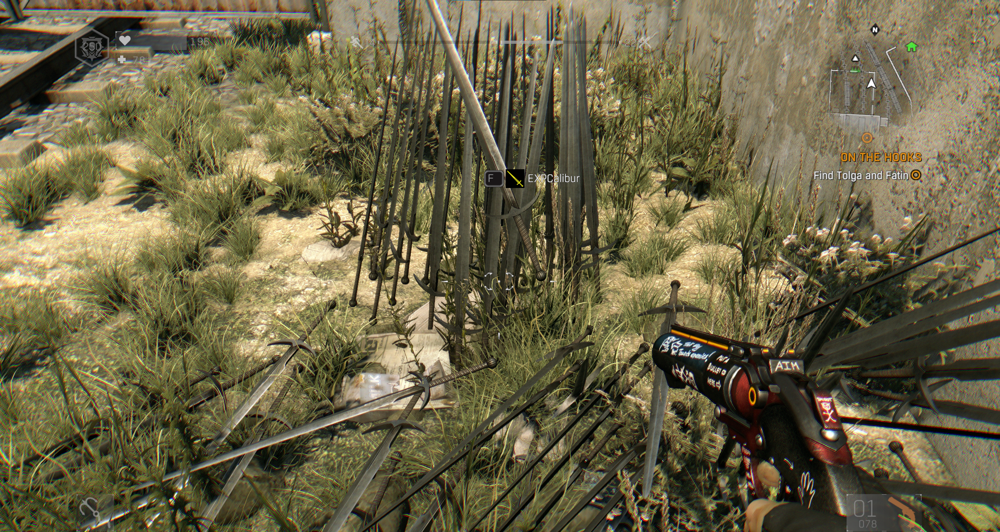
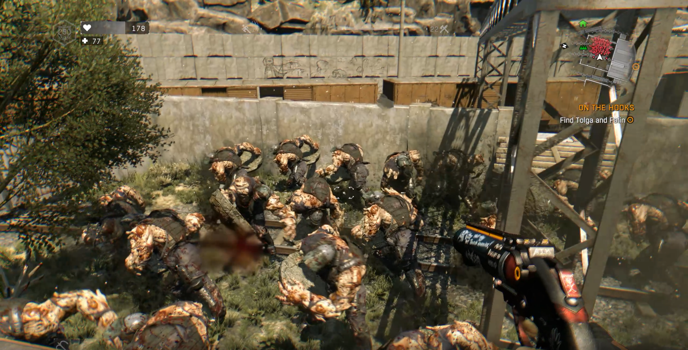
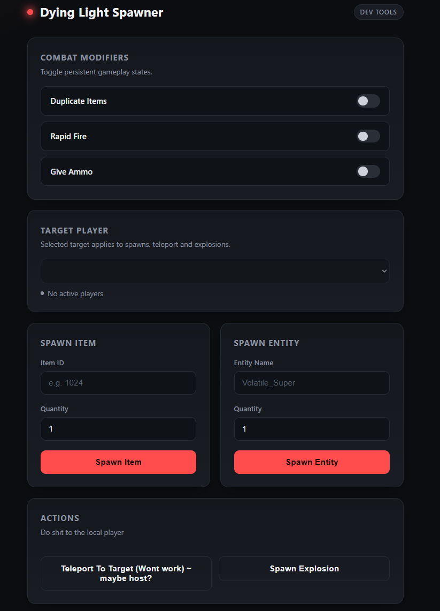

# DL1 Spawner
A simple item spawner, entity spawner, and gameplay modifier tool for **Dying Light 1**, controlled through a local web-based control panel.





Messy codebase, made very quickly

## Features

### Web Control Panel
All features are controlled through a browser-based panel served locally by the DLL. Once injected, the panel opens automatically at:
```text
http://127.0.0.1:31847
```
The panel shows all active players in your session and lets you pick a target player for spawns, teleport, and explosions.

### Item Spawner
Spawn any item using its internal item ID and the desired quantity, targeted at any active player.

A copy of `dumped_items.txt` is included in this repository for convenience. If an ID from the included list no longer works, dump the IDs again from your current game version.

### Entity Spawner
Spawn AI entities by name (e.g. `Volatile_Super`) at a target player's location, with a configurable quantity.

A copy of `human_ai_entities.txt` is included in this repository for convenience, you can also dump this.

### Teleport
Semi-working, rubberbands, haven't tested as local host, might work, but its for sure possible, just testing a cheap way

### Explosion
Trigger an explosion at the selected target player's position.

### Combat Modifiers
Toggle switches in the panel for:
* **Duplicate Items** — drop inventory items without removing them from your inventory.
* **Rapid Fire** — removes weapon fire rate limits.
* **Give Ammo** — not implemented

## Installation

### Precompiled Release
1. Download the latest build from the [Releases](../../releases) page.
2. Launch Dying Light.
3. Enter a loaded save.
4. Inject the DLL into the Dying Light process using a DLL injector.
5. The control panel will open automatically in your browser. If it doesn't, navigate to `http://127.0.0.1:31847` manually.

[Xenos](https://github.com/darthton/xenos) is one injector that can be used.

### Building From Source
1. Clone or download this repository.
2. Open the solution in Visual Studio.
3. Select **Release** and **x64**.
4. Build the solution.
5. Inject the compiled DLL into the Dying Light process.

## Usage

To spawn an item:
1. Open the control panel.
2. Select a target player.
3. Enter a valid item ID and quantity under **Spawn Item**.
4. Press **Spawn Item**.

To refresh the item list, press **End** while in-game and check `dumped_items.txt` in the game directory.

To spawn an entity:
1. Select a target player.
2. Enter an entity name and quantity under **Spawn Entity**.
3. Press **Spawn Entity**.

To duplicate an item:
1. Enable **Duplicate Items** in the panel.
2. Open your inventory.
3. Drop the item normally.
4. Pick up the dropped copy or continue dropping additional copies.

To teleport or trigger an explosion:
1. Select a target player.
2. Press **Teleport To Target** or **Spawn Explosion**.

## Notes
* Intended for the Windows version of Dying Light 1.
* Game updates may change or invalidate item IDs.
* The control panel binds to `127.0.0.1` only and is not reachable outside your machine.
* Antivirus software may flag injected DLLs.

## Disclaimer
This project is not affiliated with or endorsed by Techland. Use it at your own risk.

If you find the project useful, consider starring the repository.
